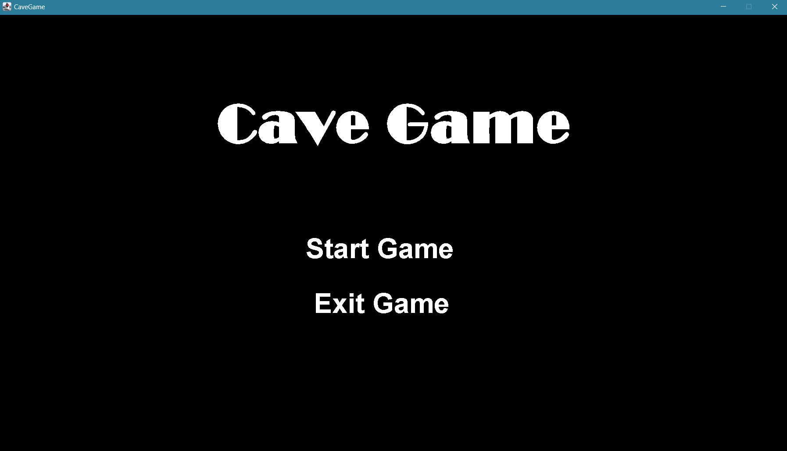
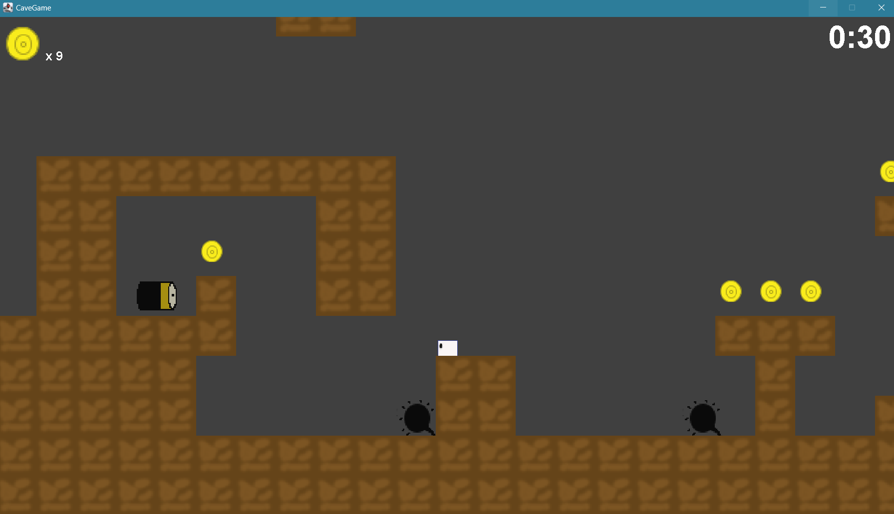
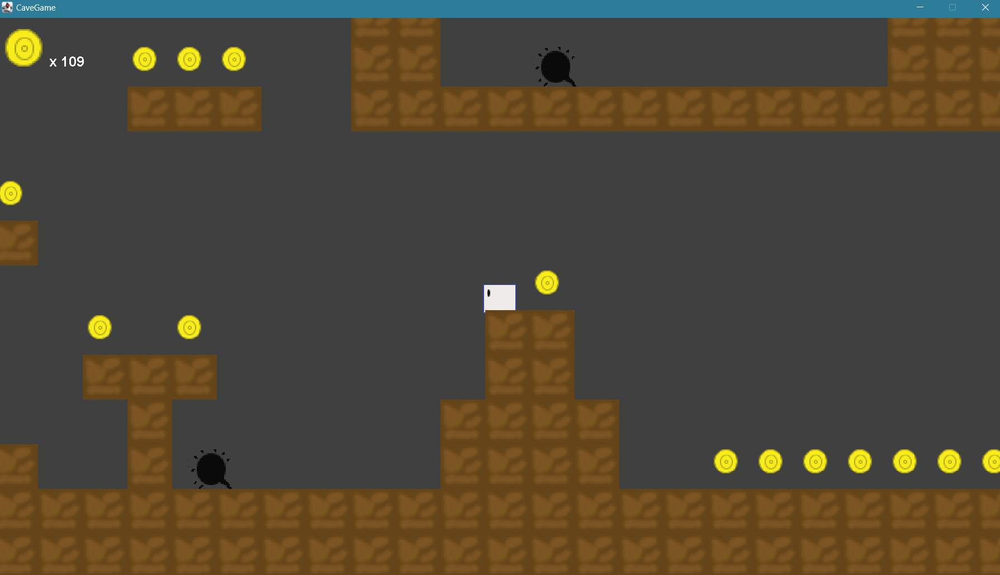
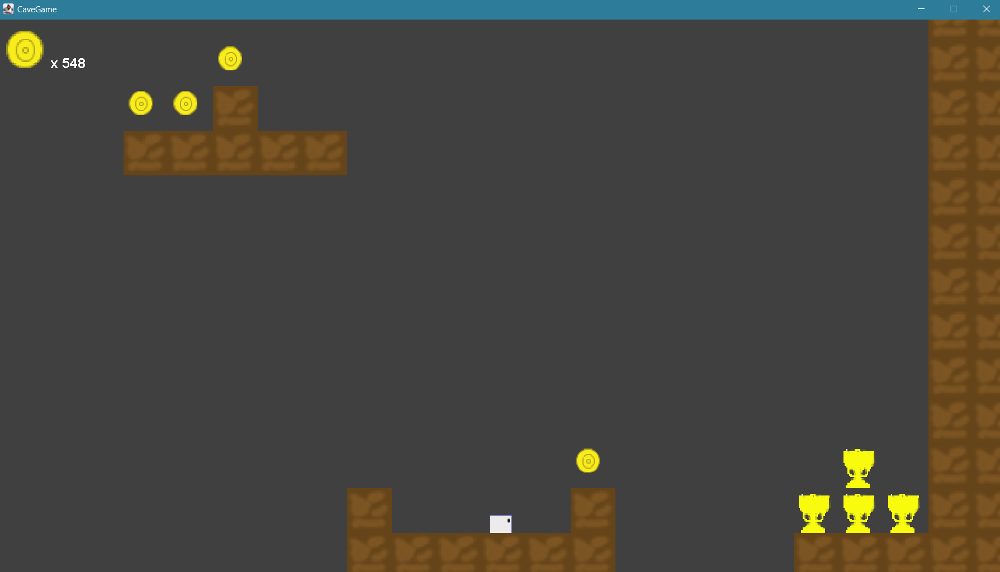
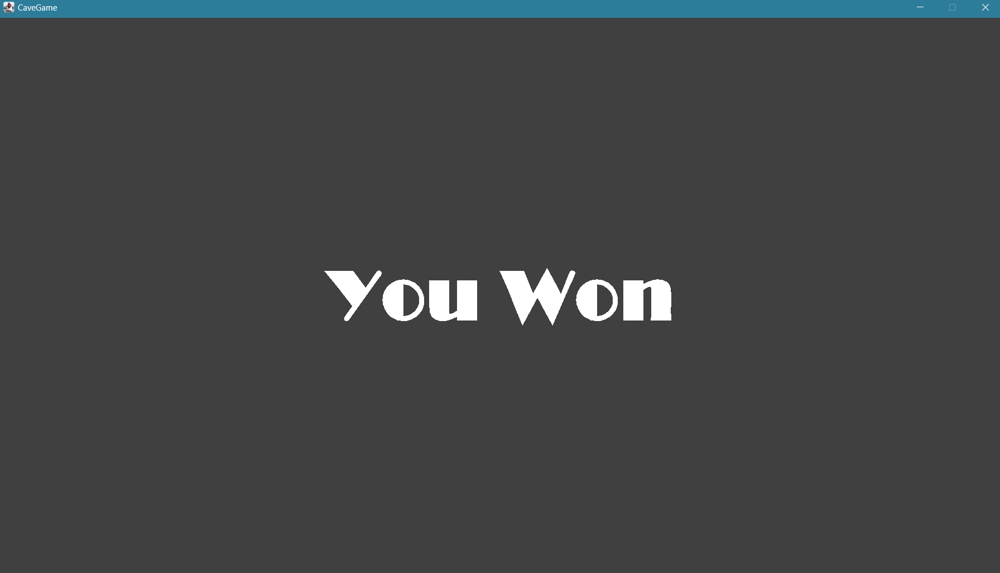
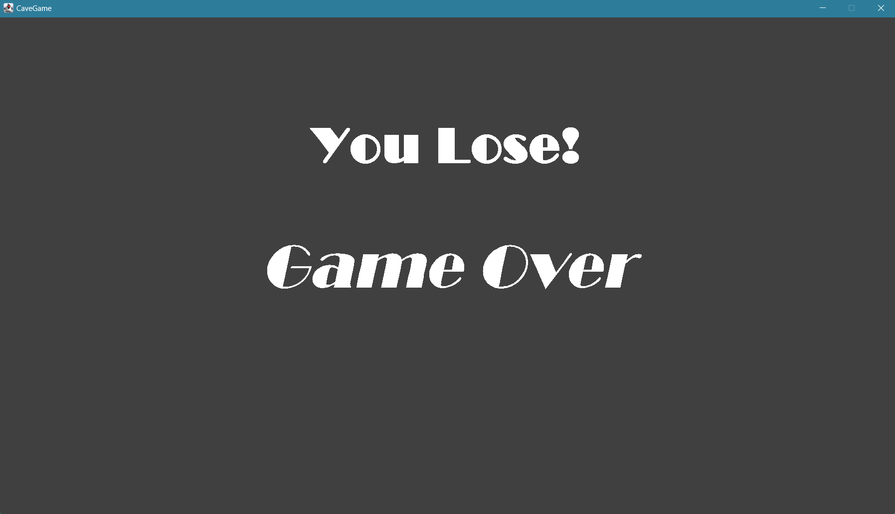

# CaveGame
CaveGame is a 2D desktop game. This game involves running in a cave, collecting coins and power-ups, and avoiding obstacles. It's similar to a Super Mario game. 
This game was built using **Java Swing** as a project for my Object Oriented Programming Language course.

## Screenshots
Here are some screenshots of this game.
### Starting Screen

### In-Game
 

### Destination

### Splash Screens

